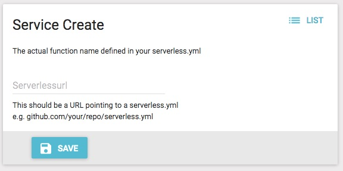

# OpenWhisk Fluid API function
This folder contains a function that translates Leap Motion actions into robot arm instructions.  Two sets of install instructions are provided below.  The first registers the function properly with Function Router so that it can work properly with the larger demo.  The second, optional, set of instructions is provided largely for troubleshooting and additional learning purpose and manually installs the function on an OpenWhisk instance.

## Register the OpenWhisk function with Function Router
Here, you will register the the function that will be automatically deployed onto your Execution Endpoint when the first lookup occurs.

On the left menu of the Function Router Console, select "Services", and then press "Create".  The resulting screen should look like this:



Note that Services might contain multiple Functions, hence the terminology.

In the 'Serverlessurl' field, enter `https://github.com/nerdguru/robotarms/fluid/openwhisk/function/serverless.yml` and press "Save".  This is the URL to the `serverless.yml` file provided for this example.  When you press "Save", the function will be prepped for deployment on any Execution Endpoint running OpenWhisk and stored in Function Router.

Be sure to note the generated Service ID, as that will be used to configure the Leap Controller later.


## Manually Installing and Invoking The Function on OpenWhisk

### Manually Installing
Start by [following the setup instructions for the Serverless Framework](https://serverless.com/framework/docs/providers/aws/guide/installation/) then:
```bash
npm install
```
will load additional dependencies this project requires.  Next, install the Serverless OpenWhisk Plugin:
```bash
npm install serverless-openwhisk
```

Finally, in your home directory, create a `.wskprops` file that looks something like this:
```bash
APIHOST=<Public IP address of your EE>
AUTH=<auth key noted from your deployed EE>
```

Now, from your project directory run:

```bash
serverless deploy
```

The expected results should be something like:

```bash
$ sls deploy
Serverless: Packaging service...
Serverless: Excluding development dependencies...
Serverless: Compiling Functions...
Serverless: Compiling Packages...
Serverless: Compiling API Gateway definitions...
Serverless: Compiling Rules...
Serverless: Compiling Triggers & Feeds...
Serverless: Deploying Functions...
Serverless: Deployment successful!

Service Information
platform:	<your public IP address>
namespace:	_
service:	robotarm

packages:
**no packages deployed**

actions:
robotarm-dev-translate

triggers:
**no triggers deployed**

rules:
**no rules deployed**

endpoints (api-gw):
**failed to fetch routes**
endpoints (web actions):
**no web actions deployed**
```
### Manually Invoking with the Serverless CLI
You can use the Serverless CLI to invoke the function, even without an OpenWhisk CLI on your system, as follows:

```bash
serverless invoke --function translate --data '{"f": "abc123", "x":0, "y":0, "z":0}'
```

The Serverless CLI will grab the values from your `.wskprops` for invoking just like it did for deploying and handle all the OpenWhisk API details.  The result should be something like this:

```bash
{
    "frameId": "abc123",
    "coordinates": {
        "xAxis": 1575,
        "yAxis": 1600,
        "zAxis": 2000
    }
}
```

### Manually Invoking with CURL
You can also invoke the function from CURL, although the text involved gets a little nasty:

```bash
curl -u <auth from .wskprops> https://<your public IP address>/api/v1/namespaces/guest/actions/robotarm-dev-translate?blocking=true -X POST -H "Content-Type: application/json" -d '{"f": "abc123", "x":0, "y":0, "z":0}' -k
```

The result is equally nasty (prettified here):

```bash
{
  "duration": 122,
  "name": "robotarm-dev-translate",
  "subject": "guest",
  "activationId": "96a2638fc40f463da2638fc40f363daf",
  "publish": false,
  "annotations": [
    {
      "key": "path",
      "value": "guest\/robotarm-dev-translate"
    },
    {
      "key": "waitTime",
      "value": 55
    },
    {
      "key": "kind",
      "value": "nodejs:6"
    },
    {
      "key": "limits",
      "value": {
        "timeout": 60000,
        "memory": 256,
        "logs": 10
      }
    },
    {
      "key": "initTime",
      "value": 110
    }
  ],
  "version": "0.0.4",
  "response": {
    "result": {
      "frameId": "abc123",
      "coordinates": {
        "xAxis": 1575,
        "yAxis": 1600,
        "zAxis": 2000
      }
    },
    "success": true,
    "status": "success"
  },
  "end": 1526569018360,
  "logs": [

  ],
  "start": 1526569018238,
  "namespace": "guest"
}
```
